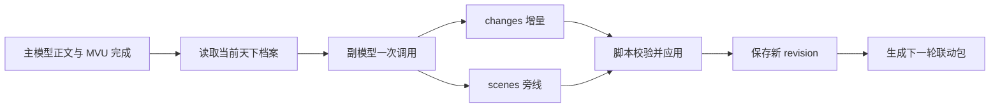

# 残明余烬 1.8：天下演化系统设计

## 1. 定位

天下演化是玩家视野外的世界状态机。它不重新生成天下档案，也不审查主模型正文。

- 主模型负责玩家当前视角正文与 MVU 更新。
- 天下演化副模型读取本轮结果和已有档案，只返回真正发生的增量。
- 脚本负责校验、合并、持久化、回滚和下一轮上下文注入。
- 旁线场景只是已接受变化的展示，不是另一套事实来源。

核心原则是：**旧状态由程序保存，模型只提出变化。**

## 2. 一轮处理流程



副模型在一次调用中同时返回变化和旁线，但两者不是“生成后再审查”的两阶段工作：

- `changes` 是唯一写入档案的输入。
- `scenes` 只能引用已接受的 `changes`。
- 脚本只做确定性结构校验，不让模型自我审查或证明事实。

`changes` 和 `scenes` 都允许为空。没有合理推进时，空结果就是正确结果。

### 2.1 自动结算触发边界

自动结算只由已经写入聊天记录的真实 assistant 楼层触发：

1. `MESSAGE_RECEIVED` 只登记一张包含聊天、楼层和 swipe 的一次性结算票据；
2. 提示词查看器、`generate()`、`generateRaw()` 及其他插件请求产生的生成生命周期事件不得创建票据；
3. 临时的 `...` 回复、静默请求、扩展消息、命令消息与首楼会被忽略；
4. 检测到 MVU 时，等待 `VARIABLE_UPDATE_ENDED`，再确认正文哈希连续稳定后消费票据；
5. MVU 未发出结束事件时，由同一张票据的超时兜底接管，不能另建第二次任务；
6. 重复的 `MESSAGE_RECEIVED`、MVU 结束事件或调度请求只会合并到现有票据；
7. 推演期间正文再次被写回时，旧结果作废，等待新哈希稳定后重新结算。

生成生命周期事件只允许服务于天下演化自己带标记的提示词 dry-run，不参与自动结算，也不能覆盖真实楼层的结算状态。

## 3. 状态所有权

天下演化只维护四类视野外记录：

| collection | 状态字段 | 用途 |
|---|---|---|
| `events` | `activeEvents` | 正在自行推进并对未来形成压力的事件 |
| `actors` | `actors` | 视野外人物的地点、目标、行动和认知 |
| `intel` | `intelPackets` | 有来源、去向、渠道和到达时间的情报 |
| `hooks` | `hooks` | 有明确触发或失效条件的延迟后果 |

以下内容不再由天下演化重复维护：

- 正文事实摘录与证据认证；
- 通用世界摘要；
- 玩家履历；
- 当前场景人物状态；
- 地图、任务与当前时空；
- 另一套秘密注册表或知识授权账本。

历史存档里的旧字段仍可兼容读取，但新流程不再产生或修改它们。

## 4. 增量协议

当前协议版本为 Schema v3。

```json
{
  "schema_version": 3,
  "base_revision": 12,
  "changes": [],
  "scenes": []
}
```

### 4.1 create

新增记录。ID 由模型显式给出，必须在对应集合中尚不存在。

```json
{
  "op": "create",
  "target": {
    "collection": "events",
    "id": "EV-kaifeng-grain-price"
  },
  "value": {
    "title": "开封粮价异动",
    "stage": "发酵",
    "status": "active",
    "location": "开封",
    "actors": ["粮商"],
    "summary": "数家粮行开始惜售",
    "nextTrigger": "官仓是否放粮",
    "impactDomains": ["民生"]
  }
}
```

### 4.2 merge

只提交被修改的字段。目标 ID 必须已经存在，未出现的字段保持原值。

```json
{
  "op": "merge",
  "target": {
    "collection": "actors",
    "id": "NPC-zhang-san"
  },
  "changes": {
    "location": "归德府",
    "currentAction": "联络旧部",
    "updatedReason": "收到可信口信"
  }
}
```

### 4.3 delete

结束或移除已有记录。目标 ID 必须已经存在。

```json
{
  "op": "delete",
  "target": {
    "collection": "hooks",
    "id": "HOOK-old-debt"
  }
}
```

同一轮不能多次修改同一个目标。无效集合、不存在的目标、重复目标、空合并和未改变实际内容的合并都会被拒绝。

## 5. 字段约束

### events

- 可改：`title`、`stage`、`status`、`location`、`actors`、`summary`、`nextTrigger`、`impactDomains`
- 新建核心字段：`title`、`stage`、`location`、`summary`、`nextTrigger`

### actors

- 可改：`name`、`location`、`goal`、`currentAction`、`knowledge`、`doesNotKnow`、`nextDecision`、`updatedReason`
- 新建核心字段：`name`、`currentAction`、`updatedReason`

### intel

- 可改：`content`、`origin`、`destination`、`channel`、`status`、`eta`、`reliability`、`knownBy`
- 新建核心字段：`content`、`origin`、`destination`、`channel`、`status`、`eta`、`reliability`

### hooks

- 可改：`title`、`stage`、`summary`、`visibleSigns`、`trigger`、`failCondition`
- 新建核心字段：`title`、`stage`、`summary`、`trigger`、`failCondition`

## 6. 旁线场景

每个场景通过 `based_on` 引用本轮 `changes` 的数组下标：

```json
{
  "based_on": [0],
  "location": "开封城南",
  "time": "入夜",
  "actors": ["粮商"],
  "action": "封仓惜售",
  "body": "最后一辆粮车驶入后，仓门落锁。账房把新价写到明日的木牌上。"
}
```

校验规则：

1. `based_on` 至少引用一项变化；
2. 每个下标都必须指向本轮已接受的变化；
3. 引用被拒绝变化的场景不会保存；
4. 不允许脱离状态变化单独生成旁线；
5. 最多保存两段。

## 7. 兼容与失败策略

- 旧档案继续归一化读取，不进行破坏性迁移。
- 新一轮只写 v3 增量；旧的 `turnFacts`、秘密和知识账本保持只读。
- `base_revision` 不一致时拒绝整轮写入，避免并发覆盖。
- 部分变化无效时，接受其余有效变化。
- 所有变化均无效且没有可用场景时，本轮报错并允许重新推演。
- 合法空结果会正常推进 revision，表示“本轮观察过，但世界没有必要变化”。
- 每轮保存 checkpoint，可按聊天楼层和 swipe 回滚或重算。

## 8. 与 MagVarUpdate 思路的对应

本设计借鉴的是“在现有结构上增删改”的核心，而不是复制具体数据结构：

- 持久状态由程序拥有；
- 模型提交有限操作；
- 操作落地前做确定性校验；
- 未修改字段原样保留；
- 不要求模型重新输出整个状态；
- 不用第二次模型调用做审查。

因此，改造后功能边界没有缩成“只记流水账”：事件、人物、情报、伏线、旁线、下一轮注入、检查点和回滚仍然存在；被移除的是重复生成、事实认证和多套账本之间的复杂耦合。
