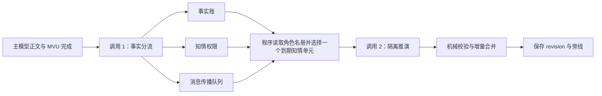

# 残明余烬 2.0：天下演化角色名册与两段式隔离设计

## 1. 目标

天下演化继续采用 MagVarUpdate 式的增量思路：档案由程序保存，模型只提交增删改。

2.0 同时解决人物全知、旁线长期空白和同一人物反复出现。原则不再是“让看过全部秘密的模型自我约束”，而是：

> 没有授权给当前推演对象的事实，绝不进入该次生成上下文。

主模型不增加事件回执，不增加输出负担。每轮最多调用副模型两次。

## 2. 一轮流程



调用数量：

- 第一调用固定用于事实分流。
- 世界书名册、既有人物、事件或伏线中存在可推进任务时进行第二调用。
- 不重试结构失败的调用，因此每轮不会超过两次模型请求。

## 3. 调用 1：事实分流

### 3.1 输入

事实分流器只读取：

- 剔除状态栏和变量块后的本轮 assistant 正文；
- 最终 MVU 中的日期、时间、地点和在场人物；
- 同地点且在最终 MVU 仍在场的上一轮场景人物。

它不读取：

- 主模型提示词快照；
- 世界书；
- 旧聊天正文；
- 天下演化中的远方人物、事件和秘密；
- 玩家上一轮输入。

因此第一调用无法替视野外人物作出反应，它只负责把正文编译成结构化事实。

### 3.2 输出

```json
{
  "schema_version": 1,
  "facts": [],
  "scene_entities": [],
  "communications": []
}
```

每条事实必须包含：

- `local_id`：本轮临时引用；
- `content`：客观事实；
- `evidence`：正文逐字原句；
- `physical_result`：已经发生的物理结果；
- `location`；
- `visibility`；
- `witnesses` 与逐人 `witness_evidence`；
- `target_groups`；
- `traces` 与 `discovery_conditions`。

可见性只有四种：

- `private`：无人获得事实；
- `witnessed`：只有带感知证据的目击者获得事实；
- `addressed`：只有明确被告知者获得事实；
- `local_public`：进入当地公开信息池，不跨地点自动传播。

事实分流器直接输出可入账的最终事实包。若模型把证据做了同义改写、使用 `{{user}}`
或省略号摘录，脚本会根据事实内容自动定位并回贴剔除变量块后的正文原句。只要能回贴到正文，就信任第一次调用给出的事实语义，不再额外做一轮字面相似度复审；只有在正文中完全找不到支撑时才丢弃该项。目击者仍必须具有同时包含人物姓名与感知内容的正文证据，不要求该人物仍留在最终 MVU 的在场名单。无法确认知情关系时保留客观事实，并降级为
`private`。

证据自动对齐只读取主模型叙事正文，`<UpdateVariable>`、`<Analysis>`、状态栏和旧的平行世界区块都不能作为事实依据。自动回贴、可见性保守降级和无效通信的静默丢弃都属于正常归一化，不显示成警告，也不计入“拒绝”；拒绝数只代表真正没有正文依据或无法归一化的客观事实。

`local_public`
还有一层程序硬门槛：证据原句必须出现告示、张贴、公开宣读、传遍、众人皆知等明确公开传播措辞。仅仅写“官府正在筹备”“某人在办理”不会被当作公开信息；模型误判时会自动降级。

这一步不是审查世界演化成品，而是低成本、带原句锚点的事实编译。

## 4. 三本权限账

### 4.1 客观事实账

继续使用 `turnFacts` 保存世界中已经发生的事实。秘密事实也会保存，但不会自动进入任何人物上下文。

### 4.2 人物知情账

继续使用人物 `knowledgeLedger`，但新增事实只通过以下来源授予：

- 正文中带证据的目击或被告知；
- 已经抵达并满足地点、群体条件的消息；
- 后续实际发现的痕迹；
- 既有合法知识。

### 4.3 消息传播账

继续使用
`intelPackets`。通信只能携带发送者已经拥有权限的事实。正文中明确归属于某人的当面发言、书信或发送动作，本身即可证明该发送者知道自己正在传递的内容，不要求事实分流模型再把发送者重复写进
`witnesses`；程序也会把这项自知事实同步写入发送者的知情账，供其离开当前画面后的隔离推演使用。通信渠道的中文名称及
`face_to_face`、`shouting` 等常见英文名称会统一归一化。

- 同地点且正文明确完成告知：直接授予接收者；
- 跨地点：写入 `in_transit`；
- 除同地点外，至少经过一个世界日；
- 更远距离按 `distanceBand` 与渠道计算最早抵达时间；
- 达到 `availableAfterWorldDays` 后由程序确定性改为 `arrived`；
- 只有地点与 `targetGroups` 匹配的人物可以读取。

`communications`
是事实编译器给出的可选传播关系，不是第二批等待审查的事实。程序能从正文定位到发送者和传递行为时就直接建立传播；引用缺失、证据不足或发送者无法确认的候选只会静默跳过，不会让已经入账的事实变成“不合规”，也不会增加整轮拒绝数。

群体匹配允许有边界的上下位名称重合，例如“邻县官府”可以匹配人物所属的“官府”；不会使用单字包含关系，避免把不相干组织误配。

## 5. 世界书角色名册

程序在第一次调用完成后，读取当前角色卡绑定的世界书，并优先使用
`===角色开始===` 到 `===角色结束===` 区间内已启用的人物条目。没有区间标记时，只识别带
`character:` 字段或以 `_SFW`、`_NSFW` 结尾的角色条目；同一人物同时存在两个版本时优先
`_SFW`。

角色名册只负责回答“这个世界里还有谁可以行动”。完整世界书内容不会写进天下档案，也不会一次性塞进模型上下文。程序只保存当轮被选中人物的最小动态记录：

- 姓名与稳定 ID；
- 当前地点；
- 当前目标与行动；
- 下一决定；
- 合法知识账；
- 最近推进原因和时间。

这样后续轮次沿用动态记录继续推进，不会每轮从人设重新开局；世界书仍是静态身份约束，天下档案则是该人物随剧情变化的生活轨迹。

## 6. 调用 2：知情单元隔离推演

程序每轮只选择一个任务：

- 一名人物；
- 一个已有事件；
- 一个已有伏线。

当前正文画面内的人物和包含这些人物的事件会被程序排除，第二调用不得在正文结束后立刻接管同一批人物。只有视野外单元才进入候选队列。

调度采用持久化的加权轮换槽：

`人物 → 人物 → 事件 → 人物 → 伏线`

某一类没有候选时自动跳到下一类。同类内部按以下顺序排序：

1. 本轮新获得合法事实的人物；
2. 从未推演或距离上次推演最久的任务；
3. 与当前地点较近的角色；
4. 总推演次数较少的任务；
5. 稳定 ID。

`worldSchedule` 会保存每个任务最近一次推进 revision、累计次数以及当前轮换槽。即使每轮都重新读取世界书，下一轮仍能延续上次选择结果；只要存在其他候选，同一人物不会一直霸占旁线。远方角色会被降低即时优先级，但不会永久饿死。

人物任务只能读取：

- 当前人物自己的一个世界书条目 `SELF_PROFILE`；
- 自身身份、地点、组织、目标和当前行动；
- 自身知识账；
- 自身目击、发现或当地公开的事实；
- 已抵达且地点、群体匹配的消息；
- 自身参与的已有事件。

已抵达消息会携带来源地、目的地、渠道、距离档位和世界日，使人物只能在自身地点作决定、发令、出发或再发送消息，不能让异地结果瞬间发生。

`SELF_PROFILE` 只代表人物自己的身份、经历、性格、社会关系和行为约束，不代表这个人物刚刚获得了任何消息。它不能被复述成人物回忆，也不能用来推断其他地点的当前状况。

第二调用明确不读取：

- `CURRENT_TURN` 或本轮正文；
- 主模型提示词快照；
- 其他人物的世界书条目与定向扫描结果；
- 秘密登记簿；
- 其他人物知识卡；
- 尚未抵达的消息内容。

事件和伏线任务也只读取自己的既有记录，不读取本轮正文和全局秘密。

人物任务是已经到期的“生活心跳”，不是可拒绝的候选。Schema 要求它至少：

- merge 一次当前人物，延续或推进 `currentAction`、`nextDecision` 或推进原因；
- 生成一段只包含该人物的旁线场景。

日常工作、准备、交际、赶路中的一步、犹豫或休息，只要真实改变行动进度或下一决定，都是有效推进；不必等到人物获知主角消息才有行动。

## 7. 输出与落地

第二调用仍返回 Schema v3 外形：

```json
{
  "schema_version": 3,
  "base_revision": 12,
  "changes": [
    {
      "op": "merge",
      "target": { "collection": "actors", "id": "AC-example" },
      "changes": { "currentAction": "继续推进自己的事务" }
    }
  ],
  "scenes": [
    {
      "based_on": [0],
      "location": "人物当前地点",
      "time": "本轮时间",
      "actors": ["当轮人物"],
      "action": "行动摘要",
      "body": "旁线正文"
    }
  ]
}
```

但 Schema 会根据任务动态收窄：

- 只能 merge/delete 当前固定目标；
- create 只能使用该任务允许的新集合；
- 旁线人物只能来自该任务的 `allowedSceneActors`；
- 因果来源只能使用该任务的 `allowedSourceIds`；
- 新消息只能是 `in_transit`。

create ID 由脚本根据任务、revision 和内容生成。模型提供的临时 ID 不直接成为存档主键。

落地阶段只做机械校验：

- JSON 与 Schema；
- revision；
- 固定目标 ID；
- 允许的集合和字段；
- 将 `label`、`description`、`causeId`、`basisIds` 等常见合法别名归一化为正式字段；
- 允许的事实、消息和事件来源 ID；
- 人物不能瞬移，旁线地点必须与当前任务地点相符；
- 场景 `based_on` 下标；
- create/merge/delete 的结构完整性。

不再对已经生成的事实或旁线做文本相似度审查，也不再让模型执行
`silentPreflight`。没有产生实际变化的 merge 会被静默忽略，不作为“不合规”警告。

## 8. 主模型按需联动

主模型不会收到全部天下档案。每次重建注入时，程序根据最近正文和当前场景筛选：

- 正文直接提到或当前在场的人物；
- 与这些人物关联、或与当前地点重合的事件；
- 正文明确追查的伏线或秘密；
- 已经抵达当前地点的消息。

未抵达的情报不会进入主模型联动包；远方人物的完整旁线正文永远不会注入。正文没有提到某个远方角色时，只在天下档案中保存其连续行动；当玩家后来接触该人物、抵达相关地点或明确追查相关事件时，程序才把压缩后的动态状态交给主模型。

这让两条要求同时成立：

- 旁线可以持续生活，不依赖主角触发；
- 主模型不会因为保存了远方旁线，就立刻让正文人物知道它。

## 9. 失败策略

- 事实分流失败：按“本轮没有新的可外传事实”处理，并跳过第二调用；不能确认现场边界时不冒险推演。
- 世界书读取失败：继续使用天下档案中已有的人物、事件和伏线，不清空既有状态。
- 世界书与档案都没有可推进任务：只保存事实与传播变化，不调用第二次模型。
- 隔离推演输出无效：不重试模型，只保留第一阶段合法事实。
- 聊天或 swipe 在任一调用期间改变：整轮结果作废并等待稳定版本重新结算。
- 两次调用都使用现有主动取消和请求超时机制。

安全方向始终是：

> 宁可少联动一轮，也不能把未授权事实交给人物生成器。

## 10. 与旧版的差异

旧版把完整正文、主模型提示词快照、定向激活世界书和多个人物状态交给一个副模型，再通过提示词与生成后校验阻止越权。

2.0 改为：

- 第一次调用只看正文，不认识视野外人物；
- 程序在两次调用之间建立事实权限；
- 第二次调用只认识一个知情单元；
- 第二次调用若推进人物，只额外读取这个人物自己的世界书条目；
- 世界书角色通过持久化公平调度依次获得生活心跳；
- 人物动态状态沿用旧档案，不从头重写；
- 旁线与增量在隔离上下文中生成；
- 主模型只收到当前视角需要的压缩联动，不接收在途情报和远方旁线；
- 旧的提示词快照与世界书补充链路不再进入自动结算主流程。

UI、触发票据、MVU 等待、聊天变量备份、checkpoint、回滚、增量存储和主模型联动注入保持兼容。
